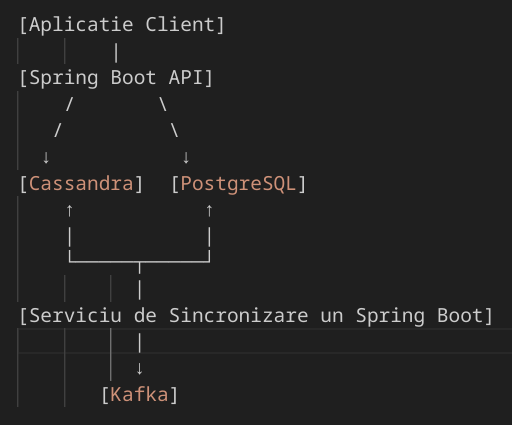

# NATI_Kld_VisionStream

CE AM FACUT:

deci e un backend in spring boot pentru inserare,update, get etc
adica e backendul principal care interactioneaza cu clusterul de baze de date cassandra

ideea care este, ca eu am facut si am testat cu urmatoarele models:

```typescript
export interface Product {
  id: number;
  name: string;
  description: string | null;
  price: number;
  quantity: number;
  category: string | null;
}

export interface ProductChange {
  id?: string;
  productId: string;
  timestamp: string;
  changeType: string;
  oldValue: string;
  newValue: string;
}
```

iti arat in typescript ca e mai usro de inteles si mai scurt dar am aceleasi models pe java
eu docamdata inserez si fac get pe Cassandra la date de genul acesta insa,
Cassandra e bun doar pentru inserare , de 100 de ori viteza de inserare mai rapida decat
orice alta baza de date,la interogari simple la fel de rapid insa
nu este absolut deloc buna la interogari complexe, joinuri, filtrari etc
iar de asta am avea nevoie de o baza de date relationala: postgres my fav

ok in acest caz ar trebui sa schimb ce date stochez in cassandra adica altfel de date de tipul:
În Cassandra (format orientat pe evenimente):

```json
{
  "event_id": "550e8400-e29b-41d4-a716-446655440000",
  "product_id": "a3d2f4r5-67f9-4a2b-a0c1-123456789abc",
  "event_type": "PRODUCT_CREATED",
  "event_data": {
    "name": "Smartphone XYZ",
    "price": 499.99,
    "category_id": "tech-123",
    "quantity": 1000
  },
  "timestamp": "2025-04-26T15:30:00Z"
}
```

adica e ca si cum cassandra e un fel de logger( pt new products sau update product) sa zic asa si e ft bun pt ca o sa inseram
cate 500 000 de date pe 10 secunde adica 50.000 pe secunda nu?

asa ca ceva de genul o sa intrea in cassandra si dupa mai avem nevoie de un backend
pentru sincronizare cassandra-> postgres, cred ca tot in srping boot ca e cel mai robust
si o sa functioneze cu Kafa adica cu cozi de mesaje pentru a fi real time si rapid

adica:


DEci Postgres vom folosi pentru interogari : luam date din postgres chit ca sunt cu cateva secunde
sau milisecunde neactualizate si le servim la backendul care se ocupa de ML unde va compara preturile si cantitatile

ok, de asta ma ocup eu sau ne consultam
asta e strict backendul backendului si se axeaza pe persistenta datelor si
acum ar trebui servite cat mai rapid si performant

ideea este asa: cand datele vin in spring backend principal o sa se trimita in cassandra
alt backend asculta , ia datele si le insereaza imediat si in postgres dupa ce sunt inserate in cassandra
( postgres nu e bun la persistenta long term sa zic asa si nu e tolerant la defecte si scalabil
iar asta e un motiv in plus de bagat si cassandra)

# GABONE:

ar trebui sa te documentezi putin despre KAFKA, ce este, cum se foloseste, la ce ajuta etc...
cum se foloseste KFKA in python pentru ca atunci cand exista date noi de update la produse ( rezultate din
procesarea ML-ului ) o sa imi trimiti mesaje intr-o coada iar eu din spring boot principal le iau si le inserez in bazele de date le actualizez

pe langa asta sa te uiti la ML , la cel de detectie de obiecte in imagini, adica sa vina imagini si el sa le faca tag, acele date adica tagurile pe care le-a identificat se trimit la un alt serviciu in python tot de IA daca vrei
care o sa compare:

1. tagurie primite si frecventa obiectului ( venite de la serviciul de IA img detection) din bufferul mare de imaginin
2. datele deja existente in baza de date postgres

cand vede ca numele produsului concide ( nu 100% ) va face modificarea pretului
si va trimite modificarea ( produsul nou, cu id cu tot ) prin Kafka catre backend pentru actualizare
